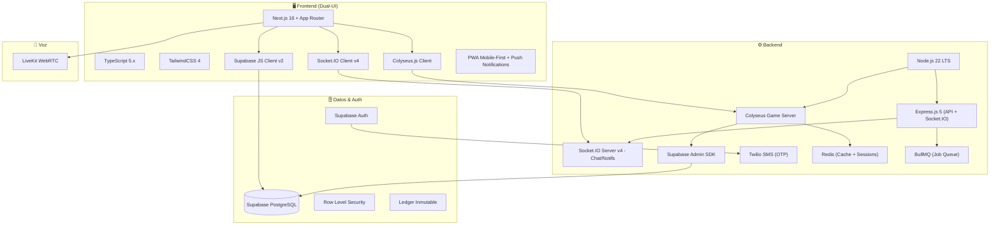
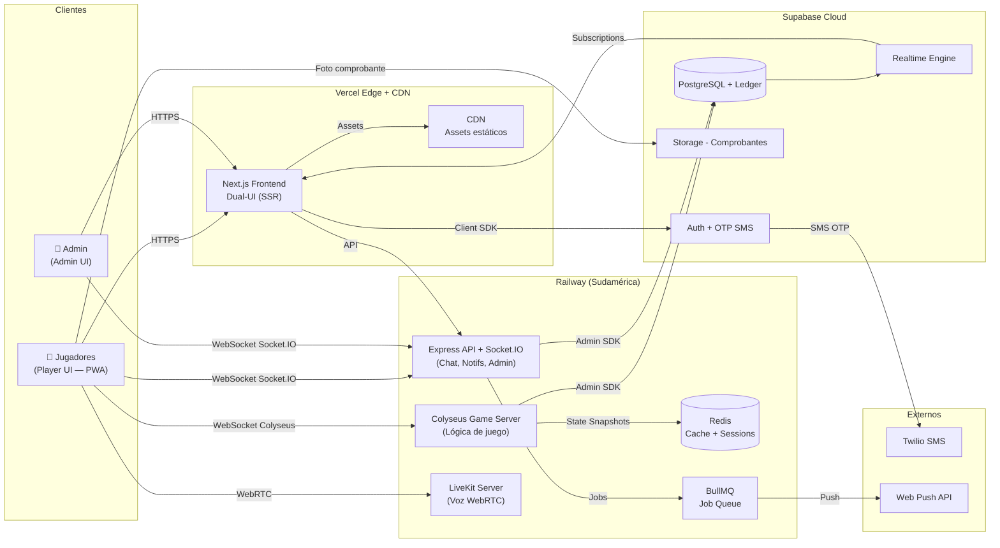
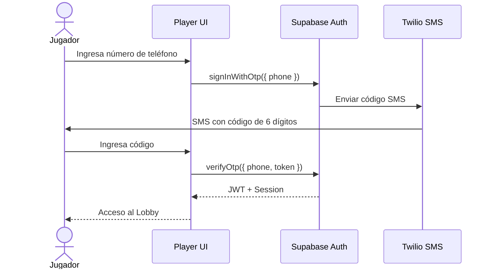
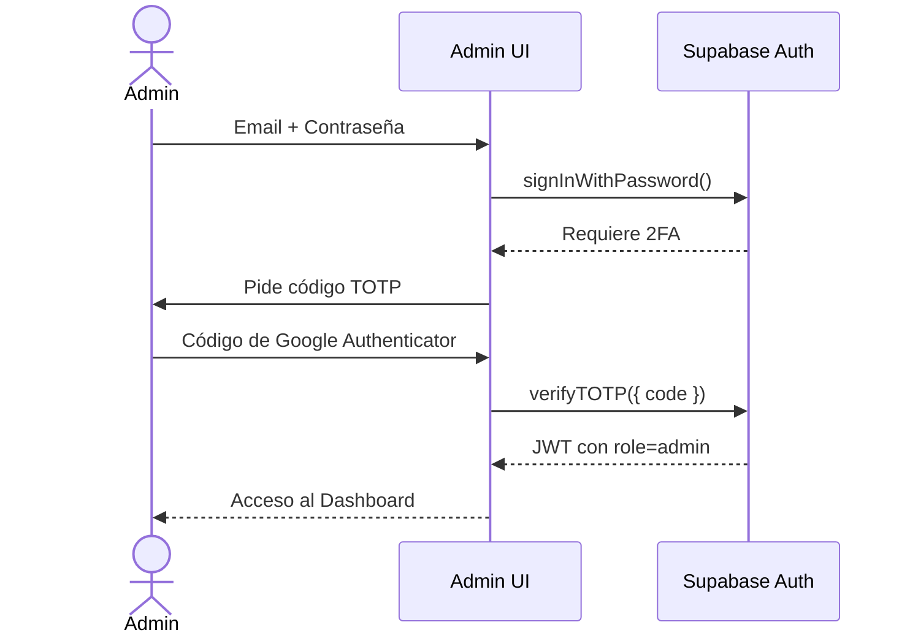
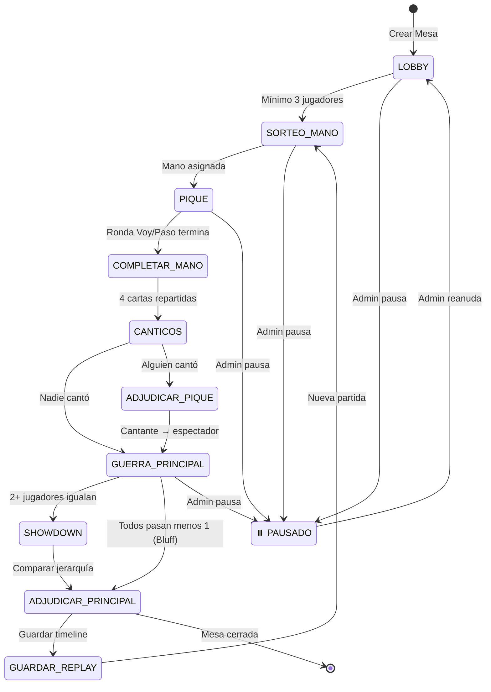
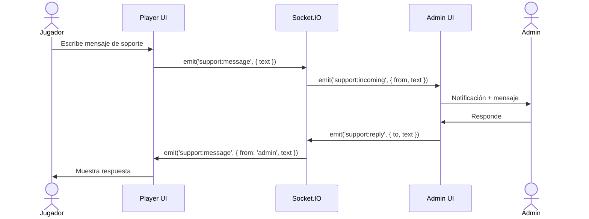
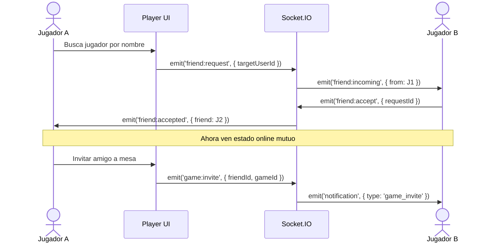
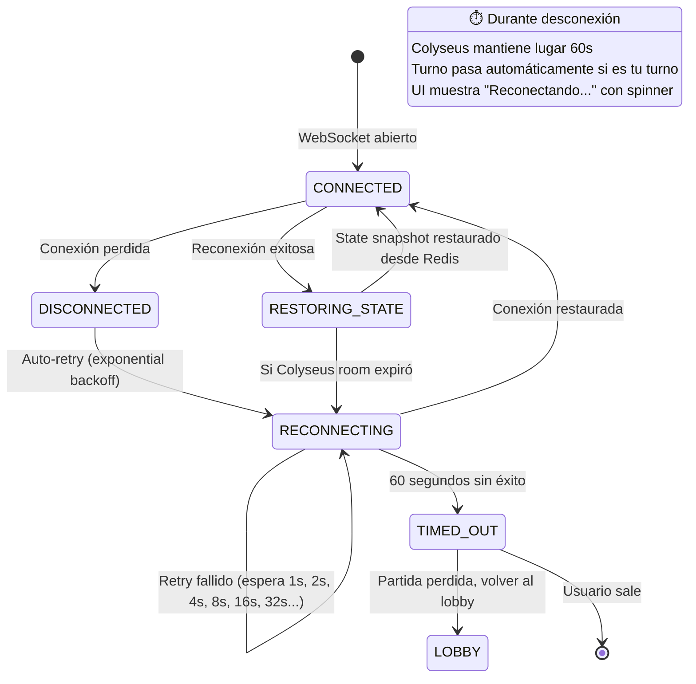

# 🃏 Plan Maestro v3.0: "Primera" — Juego de Cartas Multijugador en Tiempo Real

> **Versión:** 3.0 — _3 de Marzo de 2026_
> **Tipo:** Documento de Planificación Portable (listo para mover al repositorio del proyecto)
> **Cambios v2.0:** Dual-UI, Ledger inmutable, Zero-Knowledge Admin, Replays, Chat de Soporte, Notificaciones Push, Reglamento.
> **Cambios v3.0:** Colyseus Game Server, RNG Criptográfico, Anti-Fraude, Sistema de Amigos, Leaderboard, Estadísticas, PWA Mobile-First, Infraestructura (Redis, BullMQ, CDN), Reconexión Detallada, Monitoring.

---

## 📋 Tabla de Contenidos

1. [Prerrequisitos para la IA](#1--prerrequisitos-para-la-ia-antes-de-empezar)
2. [Propuesta y Justificación del Stack](#2--propuesta-y-justificación-del-stack-tecnológico)
3. [Arquitectura de Sistemas](#3--arquitectura-de-sistemas-y-despliegue)
4. [Arquitectura Dual-UI](#4--arquitectura-dual-ui)
5. [Autenticación y Seguridad](#5--autenticación-y-seguridad)
6. [Estructura de Base de Datos](#6--estructura-de-base-de-datos)
7. [Seguridad: RLS y Zero-Knowledge del Admin](#7--seguridad-rls-y-zero-knowledge-del-admin)
8. [Reglas de Negocio — Motor del Juego](#8--reglas-de-negocio--motor-del-juego)
9. [Sistema de Repeticiones (Replays)](#9--sistema-de-repeticiones-replays)
10. [Comunicación y Notificaciones](#10--comunicación-y-notificaciones)
11. [Libro de Reglamentos](#11--libro-de-reglamentos)
12. [RNG Criptográfico y Barajeo Seguro](#12--rng-criptográfico-y-barajeo-seguro)
13. [Anti-Fraude y Seguridad Avanzada](#13--anti-fraude-y-seguridad-avanzada)
14. [Social: Amigos, Leaderboard y Estadísticas](#14--social-amigos-leaderboard-y-estadísticas)
15. [PWA Mobile-First](#15--pwa-mobile-first)
16. [Infraestructura y Reconexión](#16--infraestructura-y-reconexión)
17. [Monitoring y Observabilidad](#17--monitoring-y-observabilidad)
18. [Plan de Desarrollo por Sprints](#18--plan-de-desarrollo-por-sprints)
19. [UX/UI — Lineamientos para Adultos Mayores](#19--uxui--lineamientos-para-adultos-mayores)
20. [Verificación y Testing](#20--plan-de-verificación-y-testing)

---

## 1. 🤖 Prerrequisitos para la IA (Antes de Empezar)

> [!CAUTION]
> Estos 3 pasos **DEBEN** ejecutarse al inicio de cada nueva sesión de trabajo, antes de escribir cualquier línea de código.

### 1.1 Instalar Skills Necesarias

```bash
# Paso 0: Instalar la skill de descubrimiento
npx skills add https://github.com/vercel-labs/skills --skill find-skills

# Paso 1: Buscar skills según el stack
npx skills find nextjs
npx skills find react
npx skills find typescript
npx skills find tailwindcss
npx skills find supabase
npx skills find socket.io
npx skills find testing
npx skills find accessibility

# Paso 2: Instalar las que se encuentren relevantes
npx skills add <owner/repo@skill> -g -y
```

**Skills prioritarias:** Next.js, React, TypeScript, TailwindCSS, Supabase, Socket.IO, Testing (Vitest/Playwright), Accessibility (a11y).

### 1.2 Reglas de Commit (Conventional Commits)

```
<tipo>(<alcance>): <descripción imperativa, max 50 chars>
```

| Tipo       | Uso                            |
| ---------- | ------------------------------ |
| `feat`     | Nueva funcionalidad            |
| `fix`      | Corrección de bug              |
| `docs`     | Solo documentación             |
| `style`    | Formato, no lógica             |
| `refactor` | Limpieza sin features ni fixes |
| `test`     | Añadir/corregir tests          |
| `chore`    | Mantenimiento (deps, configs)  |

**Reglas:** Inglés, imperativo presente, sin punto final, cuerpo opcional con `Closes #N`.

### 1.3 Uso Obligatorio de MCPs

| MCP            | Cuándo                                                              |
| -------------- | ------------------------------------------------------------------- |
| **Context7**   | **SIEMPRE** para código, configuración o documentación de librerías |
| **GitHub MCP** | Branches, PRs, issues, gestión del repositorio                      |

> [!IMPORTANT]
> La IA **NUNCA** debe inventar APIs. Siempre verificar con Context7 antes de implementar.

---

## 2. 🛠 Propuesta y Justificación del Stack Tecnológico

### Stack Definitivo



### Justificación por Componente

| Componente         | Elección                                                        | Por qué                                                                                                                                                     |
| ------------------ | --------------------------------------------------------------- | ----------------------------------------------------------------------------------------------------------------------------------------------------------- |
| **Frontend**       | Next.js 16 (App Router) + TS + TailwindCSS 4                    | SSR, routing por carpetas (perfecto para Dual-UI), streaming, tipado estricto, prototipado rápido con alto contraste                                        |
| **Game Server**    | **Colyseus** + Node.js 22 (separado)                            | Framework de juegos Node.js: sync automática de estado con delta-compression, rooms/matchmaking built-in, reconexión nativa, modelo autoritativo por diseño |
| **Chat/Notifs**    | Socket.IO v4 (separado del game server)                         | Namespaces (`/support`, `/notifications`), reconexión automática, fallback HTTP long-polling. **Solo para chat y notificaciones, NO para lógica de juego**  |
| **Base de Datos**  | Supabase (PostgreSQL)                                           | Transacciones ACID para dinero real, RLS para ceguera del admin, Realtime subscriptions, Auth integrado                                                     |
| **Cache/Sesiones** | Redis                                                           | Estado de sesión, cache de rooms activas, datos frecuentes, state snapshots para reconexión                                                                 |
| **Job Queue**      | BullMQ                                                          | Notificaciones push, procesamiento de comprobantes, tareas diferidas                                                                                        |
| **Auth SMS**       | Supabase Auth + Twilio                                          | OTP por teléfono sin contraseñas. Twilio como provider de SMS en Supabase                                                                                   |
| **Voz**            | LiveKit                                                         | Open-source, self-hosteable, $0 self-hosted, 20-100ms latencia                                                                                              |
| **Deploy**         | Vercel (front) + Railway (back + LiveKit) + Supabase Cloud (DB) | Edge network, WebSockets en Railway, PostgreSQL gestionado, CDN para assets estáticos (cartas SVG, sonidos)                                                 |

---

## 3. 🏗 Arquitectura de Sistemas y Despliegue



### Flujo de Comunicación

1. **Auth Jugador:** Cliente → Supabase Auth → Twilio SMS → OTP verificado
2. **Auth Admin:** Login + 2FA obligatorio (TOTP via app authenticator)
3. **UI:** Cliente → Next.js en Vercel (páginas separadas Player/Admin)
4. **Juego real-time:** Cliente ↔ **Colyseus Game Server** en Railway (estado sincronizado automáticamente)
5. **Chat/Soporte:** Cliente ↔ Socket.IO en Express (namespace `/support`)
6. **Notificaciones:** Socket.IO namespace `/notifications` + BullMQ → Web Push API
7. **Voz:** Cliente ↔ LiveKit en Railway
8. **Transacciones:** Colyseus Server → Supabase PostgreSQL (**server-side exclusivo**)
9. **Comprobantes:** Jugador → Supabase Storage → Admin los ve en su bandeja
10. **State Recovery:** Colyseus guarda snapshots en Redis → reconexión instantánea

> [!CAUTION]
> **Regla de oro:** Todas las operaciones de dinero/fichas se ejecutan **EXCLUSIVAMENTE** en el backend (Colyseus server). El cliente **NUNCA** modifica saldos.

---

## 4. 🎭 Arquitectura Dual-UI

### Estructura de Carpetas Next.js (Route Groups)

```
src/app/
├── (player)/                   # 👤 INTERFAZ JUGADOR
│   ├── layout.tsx              # Layout simplificado, botones grandes
│   ├── page.tsx                # Landing / Login OTP
│   ├── lobby/
│   │   └── page.tsx            # Lista de mesas disponibles
│   ├── game/
│   │   └── [gameId]/
│   │       └── page.tsx        # Mesa de juego activa
│   ├── wallet/
│   │   ├── page.tsx            # Saldo + historial de fichas
│   │   ├── deposit/
│   │   │   └── page.tsx        # Subir comprobante de depósito
│   │   └── withdraw/
│   │       └── page.tsx        # Solicitar retiro
│   ├── replays/
│   │   └── [gameId]/
│   │       └── page.tsx        # Visor de repeticiones
│   ├── friends/
│   │   └── page.tsx            # Lista de amigos + invitar
│   ├── stats/
│   │   └── page.tsx            # Dashboard estadísticas personales
│   ├── leaderboard/
│   │   └── page.tsx            # Clasificaciones semanal/mensual
│   ├── rules/
│   │   └── page.tsx            # Reglamento del Local
│   └── support/
│       └── page.tsx            # Chat de soporte con Admin
│
├── (admin)/                    # 👑 INTERFAZ ADMIN
│   ├── layout.tsx              # Layout admin con sidebar
│   ├── page.tsx                # Dashboard de métricas
│   ├── deposits/
│   │   └── page.tsx            # Bandeja de comprobantes (aprobar/rechazar)
│   ├── withdrawals/
│   │   └── page.tsx            # Solicitudes de retiro
│   ├── users/
│   │   └── page.tsx            # Gestión usuarios (banear, historial)
│   ├── tables/
│   │   └── page.tsx            # Control de mesas (pausar, cerrar, expulsar)
│   ├── ledger/
│   │   └── page.tsx            # Libro Mayor completo + auditoría
│   ├── replays/
│   │   └── [gameId]/
│   │       └── page.tsx        # Visor de repeticiones (admin)
│   ├── rules/
│   │   └── page.tsx            # Reglamento + edición
│   ├── support/
│   │   └── page.tsx            # Chat de soporte con jugadores
│   └── broadcast/
│       └── page.tsx            # Enviar notifs masivas
│
├── api/                        # API Routes compartidas
│   ├── auth/
│   ├── webhooks/
│   └── push/
│
└── shared/                     # Componentes compartidos
    ├── components/
    ├── hooks/
    ├── lib/
    └── types/
```

### Flujos Diferenciales

| Acción         | Jugador                                | Admin                                   |
| -------------- | -------------------------------------- | --------------------------------------- |
| **Login**      | Teléfono + OTP SMS                     | Email + Contraseña + 2FA TOTP           |
| **Ver cartas** | Solo las propias (en partida activa)   | ❌ **PROHIBIDO** durante partida activa |
| **Depósito**   | Sube foto de comprobante               | Ve bandeja, aprueba/rechaza             |
| **Retiro**     | Solicita retiro (validación de nombre) | Procesa retiro manualmente              |
| **Mesa**       | Juega                                  | Pausa, cierra, expulsa jugadores        |
| **Replay**     | Ve sus partidas pasadas                | Ve todas las partidas                   |
| **Usuarios**   | N/A                                    | Banea, desbanea, ve historial           |
| **Broadcast**  | Recibe notificaciones                  | Envía notificaciones masivas            |

---

## 5. 🔐 Autenticación y Seguridad

### Jugadores: Zero-Password (OTP SMS)



- Sin contraseñas, sin emails
- Registro automático en primer login (Supabase lo crea)
- Jugador solo necesita: **nombre para mostrar** + **teléfono**

### Admin: Email + Contraseña + 2FA Obligatorio



- 2FA obligatorio con TOTP (Google Authenticator / Authy)
- Enroll de 2FA forzado en primer login

### Reglas de Retiro

> [!WARNING]
> **Validación estricta de identidad:** Un retiro solo se procesa si el nombre de la cuenta bancaria/Nequi del destino coincide **exactamente** con el `display_name` registrado del jugador. Si no coincide → rechazo automático + alerta al admin.

```
Flujo de retiro:
1. Jugador solicita retiro → indica monto + cuenta destino (banco/Nequi)
2. Sistema valida: nombre_titular_cuenta === users.display_name
3. Si NO coincide → RECHAZADO automáticamente
4. Si coincide → entra a cola del Admin
5. Admin revisa y aprueba → fondos transferidos manualmente
6. Se registra en el Ledger con ambas firmas (jugador solicitó, admin aprobó)
```

---

## 6. 🗄 Estructura de Base de Datos

### Esquema Relacional Completo (PostgreSQL / Supabase)

```mermaid
erDiagram
    USERS ||--o{ PLAYERS : "juega como"
    USERS ||--o{ LEDGER : "tiene movimientos"
    USERS ||--o{ DEPOSIT_REQUESTS : "solicita"
    USERS ||--o{ WITHDRAWAL_REQUESTS : "solicita"
    USERS ||--o{ SUPPORT_MESSAGES : "envía"
    USERS ||--o{ NOTIFICATIONS : "recibe"
    USERS ||--o{ FRIENDSHIPS : "tiene amigos"
    USERS ||--|| PLAYER_STATS : "tiene estadísticas"
    USERS ||--o{ USER_DEVICES : "tiene dispositivos"
    GAMES ||--o{ PLAYERS : "contiene"
    GAMES ||--o{ ROUNDS : "tiene"
    GAMES ||--o{ LEDGER : "genera"
    GAMES ||--o{ GAME_REPLAYS : "almacena"
    ROUNDS ||--o{ ROUND_ACTIONS : "contiene"

    USERS {
        uuid id PK
        text display_name "nombre visible (debe coincidir con cuenta bancaria)"
        text phone UK "número de teléfono único"
        text email "nullable, solo admin"
        int balance_cents "saldo en centavos"
        text role "player | admin"
        boolean is_banned "default false"
        text ban_reason "nullable"
        timestamp banned_at "nullable"
        uuid banned_by "FK a admin que baneó"
        boolean is_2fa_enrolled "solo para admins"
        jsonb withdrawal_accounts "cuentas bancarias/Nequi verificadas"
        timestamp created_at
        timestamp last_login
    }

    GAMES {
        uuid id PK
        text status "waiting | playing | paused | finished | closed_by_admin"
        int max_players "default 7"
        int min_players "default 3"
        int min_bet_cents
        uuid created_by FK
        uuid mano_player_id FK
        int mano_points
        int pique_pot_cents "pote del pique en centavos"
        int main_pot_cents "pote principal en centavos"
        uuid paused_by "FK admin que pausó"
        text pause_reason "nullable"
        timestamp started_at
        timestamp finished_at
    }

    PLAYERS {
        uuid id PK
        uuid user_id FK
        uuid game_id FK
        int seat_number "1-7"
        jsonb hand "cartas - SOLO visible server-side"
        int points_sum "suma auto de puntos"
        text special_play "primera | segunda | chivo | null"
        text status "active | folded | spectator | pique_winner | expelled"
        int bet_current_cents
        timestamp joined_at
    }

    ROUNDS {
        uuid id PK
        uuid game_id FK
        int round_number
        text phase "sorteo | pique | complete_hand | canticos | main_war | showdown"
        jsonb deck_state "estado de la baraja (server-side)"
        timestamp created_at
    }

    ROUND_ACTIONS {
        uuid id PK
        uuid round_id FK
        uuid player_id FK
        text action_type "voy | paso | cantar | bet_raise"
        int amount_cents
        int sequence_order
        timestamp created_at
    }

    LEDGER {
        uuid id PK
        uuid user_id FK
        uuid game_id FK "nullable"
        uuid counterpart_id FK "nullable - admin o jugador contraparte"
        text type "deposit | withdrawal | bet | win | rake | refund | admin_adjustment"
        text direction "credit | debit"
        int amount_cents "siempre positivo"
        int balance_before_cents
        int balance_after_cents
        text description "detalle legible"
        text reference_id "ID externo (comprobante, nequi, etc)"
        uuid approved_by "FK admin que aprobó"
        text status "pending | completed | rejected | reversed"
        jsonb metadata "datos extra en JSON"
        timestamp created_at
    }

    DEPOSIT_REQUESTS {
        uuid id PK
        uuid user_id FK
        int amount_cents
        text proof_image_url "URL en Supabase Storage"
        text status "pending | approved | rejected"
        text rejection_reason "nullable"
        uuid reviewed_by FK "admin"
        timestamp created_at
        timestamp reviewed_at
    }

    WITHDRAWAL_REQUESTS {
        uuid id PK
        uuid user_id FK
        int amount_cents
        text destination_type "bank | nequi"
        text destination_account
        text destination_holder_name "DEBE coincidir con display_name"
        text status "pending | approved | rejected"
        text rejection_reason "nullable"
        boolean name_match_verified "auto-check del sistema"
        uuid reviewed_by FK
        timestamp created_at
        timestamp reviewed_at
    }

    GAME_REPLAYS {
        uuid id PK
        uuid game_id FK
        int round_number
        jsonb timeline "array de eventos cronológicos"
        jsonb final_hands "todas las cartas al descubierto"
        jsonb pot_breakdown "desglose del pote"
        uuid winner_id FK
        timestamp created_at
    }

    SUPPORT_MESSAGES {
        uuid id PK
        uuid sender_id FK
        uuid receiver_id FK "admin o jugador"
        text message
        text channel "player_to_admin | admin_to_player | broadcast"
        boolean is_read "default false"
        timestamp created_at
    }

    NOTIFICATIONS {
        uuid id PK
        uuid user_id FK "nullable para broadcasts"
        text type "friend_online | broadcast | deposit_approved | withdrawal_processed | game_invite | ban_notice"
        text title
        text body
        text action_url "nullable - deep link"
        boolean is_read "default false"
        timestamp created_at
    }

    FRIENDSHIPS {
        uuid id PK
        uuid user_id FK
        uuid friend_id FK
        text status "pending | accepted | blocked"
        timestamp created_at
    }

    PLAYER_STATS {
        uuid id PK
        uuid user_id FK UK
        int games_played "default 0"
        int games_won "default 0"
        int current_streak "racha actual"
        int best_streak "mejor racha"
        int primeras_count "veces que sacó primera"
        int chivos_count "veces que sacó chivo"
        int segundas_count "veces que sacó segunda"
        int total_rake_paid_cents "rake total pagado"
        int total_won_cents "total ganado"
        int total_lost_cents "total perdido"
        timestamp last_game_at
        timestamp updated_at
    }

    USER_DEVICES {
        uuid id PK
        uuid user_id FK
        text fingerprint "hash del browser fingerprint"
        text ip_address "última IP conocida"
        text user_agent "User-Agent del navegador"
        boolean is_flagged "dispositivo sospechoso"
        timestamp first_seen
        timestamp last_seen
    }
```

### Tabla LEDGER: El Libro Mayor Inmutable

> [!CAUTION]
> La tabla `LEDGER` es **inmutable por diseño**. Nunca se hace `UPDATE` ni `DELETE`. Para corregir un error se crea un asiento inverso (`refund` o `admin_adjustment`). Esto garantiza trazabilidad absoluta de cada centavo.

```sql
-- Proteger el Ledger: NADIE puede UPDATE o DELETE
CREATE POLICY "ledger_insert_only_backend" ON ledger
  FOR INSERT WITH CHECK (true); -- Solo vía service_role

CREATE POLICY "ledger_no_update" ON ledger
  FOR UPDATE USING (false);

CREATE POLICY "ledger_no_delete" ON ledger
  FOR DELETE USING (false);

-- Los usuarios solo ven SUS propios movimientos
CREATE POLICY "ledger_select_own" ON ledger
  FOR SELECT USING (auth.uid() = user_id);

-- Admin ve TODO el ledger (vía rol en JWT)
CREATE POLICY "ledger_select_admin" ON ledger
  FOR SELECT USING (
    (SELECT role FROM users WHERE id = auth.uid()) = 'admin'
  );
```

### Función Atómica: Adjudicar Pote con Rake (v2.0 con Ledger)

```sql
CREATE OR REPLACE FUNCTION award_pot(
  p_winner_id UUID,
  p_game_id UUID,
  p_pot_amount_cents INT,
  p_admin_id UUID
) RETURNS VOID AS $$
DECLARE
  v_rake INT := FLOOR(p_pot_amount_cents * 0.05);
  v_winner_amount INT := p_pot_amount_cents - v_rake;
  v_winner_balance INT;
  v_admin_balance INT;
BEGIN
  -- 1. Acreditar al ganador (95%)
  UPDATE users SET balance_cents = balance_cents + v_winner_amount
  WHERE id = p_winner_id
  RETURNING balance_cents INTO v_winner_balance;

  INSERT INTO ledger (user_id, game_id, type, direction, amount_cents,
    balance_before_cents, balance_after_cents, description, status)
  VALUES (p_winner_id, p_game_id, 'win', 'credit', v_winner_amount,
    v_winner_balance - v_winner_amount, v_winner_balance,
    format('Ganó pote (%s%% neto) de partida', 95), 'completed');

  -- 2. Acreditar al admin (5% rake)
  UPDATE users SET balance_cents = balance_cents + v_rake
  WHERE id = p_admin_id
  RETURNING balance_cents INTO v_admin_balance;

  INSERT INTO ledger (user_id, game_id, counterpart_id, type, direction,
    amount_cents, balance_before_cents, balance_after_cents, description, status)
  VALUES (p_admin_id, p_game_id, p_winner_id, 'rake', 'credit', v_rake,
    v_admin_balance - v_rake, v_admin_balance,
    format('Rake 5%% de partida'), 'completed');
END;
$$ LANGUAGE plpgsql SECURITY DEFINER;
```

---

## 7. 🛡 Seguridad: RLS y Zero-Knowledge del Admin

### El Principio de Ceguera del Admin

> [!CAUTION]
> **REGLA CRÍTICA:** El Administrador tiene **ESTRICTAMENTE PROHIBIDO** ver las cartas de los jugadores durante una partida activa. Esto se garantiza en **3 capas**:

#### Capa 1: Row Level Security (PostgreSQL)

```sql
-- NADIE puede ver cartas ajenas, ni siquiera el admin
CREATE POLICY "players_own_hand_only" ON players
  FOR SELECT USING (
    -- El jugador solo ve su propia mano
    auth.uid() = user_id
    OR
    -- ó si el juego ya terminó (para replays)
    (SELECT status FROM games WHERE id = game_id) IN ('finished', 'closed_by_admin')
  );

-- El admin puede ver metadatos de players pero NO el campo hand
-- Se implementa mediante una VIEW:
CREATE VIEW players_admin_view AS
  SELECT id, user_id, game_id, seat_number, points_sum,
         special_play, status, bet_current_cents, joined_at,
         NULL::jsonb AS hand  -- 🔒 SIEMPRE null para admin
  FROM players;

-- Policy en la view
CREATE POLICY "admin_players_no_hand" ON players_admin_view
  FOR SELECT USING (
    (SELECT role FROM users WHERE id = auth.uid()) = 'admin'
  );
```

#### Capa 2: Colyseus State Sync (Filtrado Automático)

```typescript
// En el Game Server (Colyseus)
import { Room, Client } from "colyseus";
import { PrimeraState, Player } from "./schemas";

// Colyseus sincroniza el estado automáticamente,
// pero usamos @filter para controlar QUÉ ve cada cliente

class PrimeraRoom extends Room<PrimeraState> {
  onCreate(options: any) {
    this.setState(new PrimeraState());
    this.maxClients = 7; // Máximo 7 jugadores por mesa
  }

  // ✅ Cada jugador SOLO ve SUS cartas
  // Colyseus @filter decorator en el schema:
  // @filter(function(client, value, root) {
  //   return this.sessionId === client.sessionId;
  // })
  // hand: ArraySchema<Card>;

  // ✅ El admin observa vía endpoint separado (NO como jugador)
  // Ve: potes, estados, saldos, cantidad de cartas
  // ❌ NUNCA recibe: cartas, composiciones, jugadas privadas

  onJoin(client: Client, options: any) {
    const player = new Player();
    player.sessionId = client.sessionId;
    player.userId = options.userId;
    this.state.players.set(client.sessionId, player);
  }

  onLeave(client: Client, consented: boolean) {
    // Permitir reconexión por 60 segundos
    this.allowReconnection(client, 60);
  }
}
```

#### Capa 3: Frontend (Admin UI — Único Observador)

```
El Admin es el ÚNICO que puede observar mesas. NO hay espectadores públicos.

La interfaz admin de "Control de Mesas" mostrará:
- Estado de la partida (fase actual, potes, saldo de jugadores)
- Jugadores (nombre, saldo, estado, cantidad de cartas)
- ❌ NUNCA renderiza cartas ni composiciones
- ❌ NO hay modo espectador para jugadores regulares (evitar trampas)
- Botones: [Pausar Mesa] [Cerrar Sala] [Expulsar Jugador]
```

### Control de Mesas por Admin

| Acción               | Efecto                                                         | Registro                                |
| -------------------- | -------------------------------------------------------------- | --------------------------------------- |
| **Pausar Mesa**      | Congela el juego, jugadores ven "Mesa Pausada por Admin"       | Log en Ledger como `admin_adjustment`   |
| **Cerrar Sala**      | Termina la partida, devuelve apuestas del pote actual          | Refund automático en Ledger             |
| **Expulsar Jugador** | Retira al jugador de la mesa, devuelve sus fichas del pote     | Refund en Ledger + notificación         |
| **Banear Usuario**   | `is_banned = true`, desconecta todos sus sockets, impide login | Registro en `users.banned_at/by/reason` |

---

## 8. 🎮 Reglas de Negocio — Motor del Juego

### La Baraja: 28 Cartas del Naipe Español

| Carta  | Puntos | Palos                        |
| ------ | ------ | ---------------------------- |
| As (1) | 16     | Oros, Copas, Espadas, Bastos |
| 2      | 12     | Oros, Copas, Espadas, Bastos |
| 3      | 13     | Oros, Copas, Espadas, Bastos |
| 4      | 14     | Oros, Copas, Espadas, Bastos |
| 5      | 15     | Oros, Copas, Espadas, Bastos |
| 6      | 18     | Oros, Copas, Espadas, Bastos |
| 7      | 21     | Oros, Copas, Espadas, Bastos |

**Fichas válidas:** `$1.000` | `$2.000` | `$5.000` | `$10.000` | `$20.000` | `$50.000`

**Jugadores por mesa:** Mínimo **3** — Máximo **7**

> [!IMPORTANT]
> Las mesas inician cuando los jugadores quieran. No hay matchmaking automático. Si hay 3 o más jugadores en la mesa, pueden empezar la partida.

### Máquina de Estados



### Fases Detalladas

#### Fase 1: Sorteo de "La Mano"

- Repartir 1 carta boca arriba por jugador
- Si no sale Oro → repartir otra encima sin recoger
- Primer jugador con Oro = **"La Mano"** (+1 punto desempate)
- Rota a la **derecha** en cada nueva partida
- Recoger y barajar las 28

#### Fase 2: El Pique (2 cartas)

- Repartir 2 cartas a cada jugador
- La Mano habla primero
- **"Voy"** = apuesta (toca ficha) → entra · **"Paso"** = bota cartas, fuera

#### Fase 3: Completar la Mano

- A los que dijeron "Voy": repartir 2 cartas más (de 1 en 1) → 4 cartas

#### Fase 4: Cánticos y Cobro del Pique

- Sistema analiza cartas en secreto → habilita botón **"Cantar"** (opcional)
- Cantar → Pote del Pique (- 5% rake) → modo **espectador**

#### Fase 5: Guerra por el Pote Principal

- Rondas: **"Voy"** (igualar/subir) o **"Paso"** (retirarse)
- **Victoria por Bluff:** todos pasan menos 1 → gana sin mostrar

#### Fase 6: Showdown — Jerarquía Estricta

| #   | Jugada           | Efecto                |
| --- | ---------------- | --------------------- |
| 🥇  | **Segunda**      | Mata todo             |
| 🥈  | **Chivo**        | Mata Primera y puntos |
| 🥉  | **Primera**      | Mata puntos           |
| 4°  | **Mayor puntos** | Suma de 4 cartas      |

**Desempate:** Empate en puntos → gana **La Mano** (o más cercano a su derecha)
**Misterio:** Perdedor puede ocultar cartas ("Paso/Botar")

#### Post-Partida: Guardar Replay

- El servidor genera un JSON inmutable con toda la línea de tiempo

---

## 9. 🎬 Sistema de Repeticiones (Replays)

### Estructura del JSON de Replay

```jsonc
{
  "gameId": "uuid",
  "roundNumber": 1,
  "createdAt": "2026-03-03T...",
  "players": [
    { "userId": "uuid", "displayName": "Don Carlos", "seatNumber": 1 }
  ],
  "manoPlayerId": "uuid",
  "timeline": [
    { "seq": 1, "phase": "sorteo", "event": "deal_card", "playerId": "uuid", "card": { "suit": "oros", "value": 3 }, "ts": 0 },
    { "seq": 2, "phase": "sorteo", "event": "mano_assigned", "playerId": "uuid", "ts": 1200 },
    { "seq": 3, "phase": "pique", "event": "deal_hand", "playerId": "uuid", "cards": [...], "ts": 2000 },
    { "seq": 4, "phase": "pique", "event": "action", "playerId": "uuid", "action": "voy", "amount": 5000, "ts": 5000 },
    { "seq": 5, "phase": "pique", "event": "action", "playerId": "uuid", "action": "paso", "ts": 7000 },
    // ...más eventos
    { "seq": 20, "phase": "showdown", "event": "reveal", "playerId": "uuid", "hand": [...], "points": 63, "specialPlay": "chivo", "ts": 45000 }
  ],
  "finalHands": {
    "uuid-player1": { "cards": [...], "points": 63, "specialPlay": "chivo" },
    "uuid-player2": { "cards": [...], "points": 58, "specialPlay": null }
  },
  "potBreakdown": {
    "piquePot": { "total": 10000, "rake": 500, "winnerId": "uuid" },
    "mainPot": { "total": 50000, "rake": 2500, "winnerId": "uuid" }
  }
}
```

### Visor de Repeticiones (UI)

- **Barra de tiempo** con slider para avanzar/retroceder evento por evento
- **Botones:** ⏮ ◀ ▶ ⏭ (como un reproductor de video)
- **Cartas visibles:** En el replay se destapan TODAS las cartas de TODOS los jugadores
- **Animaciones:** Cada evento se reproduce con animación (reparto, volteo, apuesta)
- **Acceso:** Jugadores ven sus propias partidas · Admin ve todas

> [!NOTE]
> Los replays son la herramienta de resolución de disputas. Si un jugador reclama, el Admin puede revisar el replay completo y ver todas las cartas para verificar.

---

## 10. 📢 Comunicación y Notificaciones

### Chat de Soporte (Texto)



- Namespace dedicado de Socket.IO: `/support`
- Historial persistente en tabla `support_messages`
- Admin ve lista de conversaciones con badge de no leídos
- Jugador ve chat simple tipo WhatsApp

### Sistema de Notificaciones

| Tipo                   | Trigger                      | Canal                    |
| ---------------------- | ---------------------------- | ------------------------ |
| `friend_online`        | Amigo se conecta             | Socket.IO + Push         |
| `deposit_approved`     | Admin aprueba depósito       | Socket.IO + Push         |
| `withdrawal_processed` | Retiro procesado             | Socket.IO + Push         |
| `game_invite`          | Mesa disponible / invitación | Socket.IO + Push         |
| `broadcast`            | Admin envía mensaje masivo   | Socket.IO + Push a TODOS |
| `ban_notice`           | Usuario baneado              | Socket.IO (desconexión)  |

**Implementación:**

- **In-App:** Socket.IO namespace `/notifications` → pop-up en tiempo real
- **Push (offline):** Web Push API (service worker) para cuando el navegador está cerrado
- **Admin Broadcast:** Formulario en Admin UI → envía a todos los usuarios conectados Y registra push para los offline

---

## 11. 📖 Libro de Reglamentos

### Contenido del Reglamento del Local

Sección estática accesible desde **ambas interfaces** (Player y Admin):

```
📖 REGLAMENTO DEL LOCAL

1. NORMAS DE CONVIVENCIA
   - Respeto entre jugadores. Insultos = ban temporal o permanente.
   - El chat de voz es para socializar. No se permiten amenazas.
   - El Admin puede silenciar o expulsar sin previo aviso por falta grave.

2. REGLAS DE JUEGO
   - Se juega con naipe español de 28 cartas (As al 7).
   - Máximo 6 jugadores por mesa.
   - La jerga oficial: "Voy" para apostar, "Paso" para retirarse.
   - Las jugadas se resuelven por jerarquía: Segunda > Chivo > Primera > Puntos.

3. REGLAS FINANCIERAS
   - Todo movimiento de fichas queda registrado en el Libro Mayor.
   - Se cobra un 5% de comisión automática sobre cada pote ganado.
   - Los depósitos requieren comprobante verificado por el Admin.
   - Los retiros solo se procesan a cuentas que coincidan con el nombre registrado.
   - Saldo mínimo para jugar: el valor de la apuesta mínima de la mesa.

4. PROHIBICIONES
   - Prohibido usar múltiples cuentas.
   - Prohibido compartir la cuenta con terceros.
   - Prohibido intentar manipular el sistema.
   - Violaciones = ban permanente + confiscación de saldo.

5. RESOLUCIÓN DE DISPUTAS
   - Todas las partidas quedan grabadas (Replays).
   - El Admin puede revisar cualquier partida para resolver reclamos.
   - La decisión del Admin es final.
```

**Implementación:**

- Archivo MDX o JSON con el contenido (para poder traducir a futuro)
- Componente `<RulebookPage />` reutilizado en `/(player)/rules` y `/(admin)/rules`
- Admin puede editar el reglamento desde su interfaz (se guarda en Supabase como texto)
- Accesible con botón persistente "📖 Reglamento" en el layout de ambas UIs

---

## 12. 🎲 RNG Criptográfico y Barajeo Seguro

> [!CAUTION]
> La integridad del juego depende de que el barajeo sea **criptográficamente seguro e impredecible**. Nunca usar `Math.random()`.

### Algoritmo de Barajeo

```typescript
import { randomBytes } from "crypto";

// Fisher-Yates shuffle con RNG criptográfico
function cryptoShuffle<T>(array: T[]): T[] {
  const shuffled = [...array];
  for (let i = shuffled.length - 1; i > 0; i--) {
    // Generar índice aleatorio criptográficamente seguro
    const randomBuffer = randomBytes(4);
    const randomValue = randomBuffer.readUInt32BE(0);
    const j = randomValue % (i + 1);
    [shuffled[i], shuffled[j]] = [shuffled[j], shuffled[i]];
  }
  return shuffled;
}

// Generar y guardar semilla para auditoría
function createDeck(gameId: string): { deck: Card[]; seed: string } {
  const seed = randomBytes(32).toString("hex");
  const baseDeck = generateBaseDeck28(); // 28 cartas naipe español
  const deck = cryptoShuffle(baseDeck);

  // Guardar seed en el replay para verificación post-partida
  return { deck, seed };
}
```

### Reglas de Auditoría

- Cada partida guarda su **seed** en el JSON de replay
- El seed permite regenerar el deck para verificar que no hubo manipulación
- **NUNCA** se expone el seed a los clientes durante la partida
- Se puede auditar offline comparando seed → deck → acciones

---

## 13. 🛡 Anti-Fraude y Seguridad Avanzada

### Anti Multi-Cuenta (Device Fingerprinting)

```typescript
// Cliente: generar fingerprint único del navegador
import FingerprintJS from "@fingerprintjs/fingerprintjs";

const fp = await FingerprintJS.load();
const result = await fp.get();
const fingerprint = result.visitorId; // hash único del dispositivo

// Se envía al backend en cada login
// Backend registra en tabla USER_DEVICES
```

**Detección:**

- Si 2+ cuentas comparten el mismo `fingerprint` → alerta al admin
- Si 2+ cuentas comparten la misma `ip_address` de forma recurrente → flag
- El admin decide si banear (podría ser familia compartiendo WiFi)

### Anti-Colusión (Detección de Patrones)

| Señal de Alerta                                                | Detección                         | Acción                        |
| -------------------------------------------------------------- | --------------------------------- | ----------------------------- |
| 2 jugadores siempre en la misma mesa                           | Query: frecuencia de co-aparición | Alerta al admin si > 80%      |
| Un jugador siempre "pasa" cuando otro "va"                     | Análisis de `round_actions`       | Flag automático               |
| Transferencia indirecta de fichas (A pierde a B repetidamente) | Análisis del Ledger entre pares   | Alerta si patrón > 5 partidas |

### Rate Limiting

```typescript
// Middleware de rate limiting (Express + Socket.IO)

// API HTTP
import rateLimit from "express-rate-limit";
const apiLimiter = rateLimit({
  windowMs: 15 * 60 * 1000, // 15 minutos
  max: 100, // máximo 100 requests por IP
});

// Socket.IO events (en el game server)
const actionLimiter = new Map<string, number[]>();
function isRateLimited(
  userId: string,
  maxActions: number = 30,
  windowMs: number = 60000,
): boolean {
  const now = Date.now();
  const actions = actionLimiter.get(userId) || [];
  const recentActions = actions.filter((t) => now - t < windowMs);
  recentActions.push(now);
  actionLimiter.set(userId, recentActions);
  return recentActions.length > maxActions;
}
```

| Recurso               | Límite        | Ventana |
| --------------------- | ------------- | ------- |
| Login OTP             | 5 intentos    | 15 min  |
| Acciones de juego     | 30 acciones   | 1 min   |
| Mensajes de chat      | 20 mensajes   | 1 min   |
| Solicitudes de retiro | 3 solicitudes | 1 hora  |
| Subir comprobante     | 5 uploads     | 1 hora  |

---

## 14. 👥 Social: Amigos, Leaderboard y Estadísticas

### Sistema de Amigos



**Features:**

- Ver amigos online/offline
- Invitar a mesa privada
- Ver últimas partidas del amigo (sin cartas, solo resultado)
- Bloquear jugador (no puede ser matcheado contigo)

### Leaderboard (Clasificaciones)

| Ranking                 | Período           | Métrica                                        |
| ----------------------- | ----------------- | ---------------------------------------------- |
| 🏆 Top Ganadores        | Semanal / Mensual | Total fichas ganadas (neto)                    |
| 🎯 Mejor Racha          | Semanal           | Mayor racha de victorias consecutivas          |
| 🃏 Maestro de "Primera" | Mensual           | Más jugadas especiales (Primera/Chivo/Segunda) |

- Visible en `/(player)/leaderboard`
- Se calcula desde `PLAYER_STATS` (actualizado al final de cada partida)
- Admin ve rankings desde el dashboard

### Estadísticas del Jugador (Dashboard)

```
📊 MIS ESTADÍSTICAS

┌─────────────────────────────────────────┐
│  Partidas Jugadas: 147                  │
│  Partidas Ganadas: 62  (42.2%)          │
│  Racha Actual: 🔥 3 victorias           │
│  Mejor Racha: 🏆 8 victorias            │
├─────────────────────────────────────────┤
│  Jugadas Especiales:                    │
│    Primera: 15  │  Chivo: 8  │  Segunda: 3  │
├─────────────────────────────────────────┤
│  💰 Balance Histórico:                  │
│    Total Ganado:  $1,240,000            │
│    Total Perdido: $980,000              │
│    Rake Pagado:   $62,000               │
│    Neto:          +$198,000             │
├─────────────────────────────────────────┤
│  📈 Gráfico de saldo (últimos 30 días) │
│    [═══════════╗                    ]   │
│                ║ ← Aquí estás           │
└─────────────────────────────────────────┘
```

---

## 15. 📱 PWA Mobile-First

> [!IMPORTANT]
> Los jugadores estarán **principalmente en dispositivos móviles**. La PWA es el target principal.

### Configuración PWA

```json
// next.config.js - PWA con next-pwa
{
  "name": "Primera — Juego de Cartas",
  "short_name": "Primera",
  "description": "Juego de cartas en tiempo real con naipe español",
  "start_url": "/",
  "display": "standalone",
  "orientation": "portrait",
  "theme_color": "#1a1a2e",
  "background_color": "#1a1a2e",
  "icons": [
    { "src": "/icons/icon-192.png", "sizes": "192x192", "type": "image/png" },
    { "src": "/icons/icon-512.png", "sizes": "512x512", "type": "image/png" }
  ]
}
```

### Features PWA

| Feature                | Implementación                                            |
| ---------------------- | --------------------------------------------------------- |
| **Instalable**         | Manifest + Service Worker → "Añadir a pantalla de inicio" |
| **Push Notifications** | Web Push API vía Service Worker + BullMQ                  |
| **Offline fallback**   | Página de "Sin conexión" con mensaje + botón reintentar   |
| **Cache de assets**    | Cartas SVG, sonidos, fuentes cacheados en Service Worker  |
| **Orientación**        | Portrait forzado en móvil, landscape opcional en tablet   |
| **Splash screen**      | Con logo y colores del juego al abrir                     |
| **Full-screen**        | Sin barra del navegador (`display: standalone`)           |

### Optimizaciones Móviles

- **Touch targets:** Mínimo 48px × 48px (botones "VOY" y "PASO" → 64px+)
- **Vibración:** `navigator.vibrate()` en acciones clave (recibir carta, ganar/perder)
- **Prevenir zoom:** `user-scalable=no` en viewport
- **Reducir datos:** Delta compression de Colyseus minimiza bandwidth
- **Wake Lock API:** Mantener pantalla encendida durante partida activa

---

## 16. 🏗 Infraestructura y Reconexión

### Redis — Cache y Estado de Sesión

```
Uso de Redis:
1. State Snapshots: Colyseus guarda snapshot del estado de cada room
   → Permite reconexión instantánea sin perder estado del juego
2. Session Cache: Tokens JWT, datos de usuario frecuentes
3. Active Rooms Registry: Lista de rooms/mesas activas para el lobby
4. Rate Limiting Counters: Contadores atómicos para rate limiting
5. Pub/Sub: Comunicación entre procesos del game server (horizontal scaling)
```

### BullMQ — Cola de Trabajos

| Job                     | Trigger                                            | Prioridad |
| ----------------------- | -------------------------------------------------- | --------- |
| `push-notification`     | Partida lista, depósito aprobado, retiro procesado | Alta      |
| `process-deposit-image` | Jugador sube comprobante                           | Media     |
| `update-leaderboard`    | Partida termina                                    | Baja      |
| `anti-collusion-check`  | Cada 100 partidas                                  | Baja      |
| `cleanup-expired-rooms` | Cron cada 5 min                                    | Baja      |

### CDN para Assets Estáticos

```
Assets servidos desde CDN (Vercel Edge / Cloudflare):
- /assets/cards/*.svg        → 28 cartas del naipe español
- /assets/sounds/*.mp3       → Efectos de sonido (reparto, apuesta, victoria)
- /assets/fonts/*.woff2      → Inter font family
- /assets/icons/*.png        → Iconos de fichas, PWA icons
```

### Estrategia de Reconexión Detallada



**Implementación de Colyseus:**

- `allowReconnection(client, 60)` → 60 segundos de gracia
- Estado del jugador se preserva en la room del servidor
- Al reconectar, Colyseus re-sincroniza el estado completo automáticamente
- Si expira → jugador se retira de la mesa, fichas del pote se devuelven

### Logging Estructurado

```typescript
// Winston/Pino con correlación por partida
const logger = pino({
  level: "info",
  formatters: {
    level: (label) => ({ level: label }),
  },
});

// Cada log incluye gameId para trazabilidad
logger.info(
  { gameId, playerId, action: "bet", amount: 5000 },
  "Player placed bet",
);
logger.warn({ gameId, playerId, reason: "timeout" }, "Player turn auto-passed");
logger.error({ gameId, error }, "Game state corruption detected");
```

---

## 17. 📊 Monitoring y Observabilidad

### Métricas de Juego

| Métrica                           | Fuente        | Alerta            |
| --------------------------------- | ------------- | ----------------- |
| Latencia promedio del game server | Colyseus      | > 200ms           |
| Partidas activas simultáneas      | Redis         | Info (sin alerta) |
| Duración promedio de partida      | PostgreSQL    | Info              |
| Tasa de abandonos mid-game        | PostgreSQL    | > 20%             |
| Reconexiones por hora             | Colyseus logs | > 50/hora         |

### Métricas Financieras (CRÍTICAS)

| Métrica                    | Cálculo                                                                  | Alerta                      |
| -------------------------- | ------------------------------------------------------------------------ | --------------------------- |
| **Integridad del Ledger**  | `SUM(balance_cents) de USERS` vs `SUM(credits) - SUM(debits) del LEDGER` | ⚠️ Si difieren en 1 centavo |
| Rake total diario          | `SUM(amount_cents) WHERE type='rake'`                                    | Info                        |
| Depósitos pendientes > 24h | `COUNT WHERE status='pending' AND age > 24h`                             | Admin                       |
| Retiros pendientes > 48h   | `COUNT WHERE status='pending' AND age > 48h`                             | Admin                       |

> [!CAUTION]
> La métrica de **Integridad del Ledger** es la más crítica. Si los saldos de usuarios no cuadran con el Ledger, hay un bug financiero grave. Se debe verificar automáticamente cada hora.

### Stack de Monitoring

- **Sentry** → Errores y excepciones (frontend + backend)
- **Pino/Winston** → Logs estructurados con correlación por `gameId`
- **Cron Job** → Verificación automática de integridad financiera cada hora
- **Admin Dashboard** → Métricas en tiempo real en `/(admin)/page.tsx`

---

## 18. 📅 Plan de Desarrollo por Sprints

### Sprint 0 — Setup & Foundation (Semana 1)

- [ ] Crear repositorio GitHub
- [ ] Inicializar Next.js 16 + TypeScript + TailwindCSS 4 + App Router
- [ ] Configurar estructura Dual-UI (`(player)` y `(admin)` route groups)
- [ ] Crear **Colyseus Game Server** (separado del frontend)
- [ ] Crear servidor Express 5 + Socket.IO v4 (para chat/notifs)
- [ ] Configurar Redis (cache + sesiones + state snapshots)
- [ ] Configurar BullMQ (cola de trabajos)
- [ ] Configurar proyecto Supabase (DB + Auth + Storage)
- [ ] Ejecutar migraciones del esquema completo (**15 tablas** incluyendo FRIENDSHIPS, PLAYER_STATS, USER_DEVICES)
- [ ] Configurar RLS policies (incluyendo ceguera del admin)
- [ ] Configurar Conventional Commits (husky + commitlint)
- [ ] Configurar CI/CD (GitHub Actions)
- [ ] Configurar PWA (manifest.json, service worker, icons)
- [ ] Instalar skills de la IA

### Sprint 1 — Auth + Wallet + Depósitos + Anti-Fraude (Semana 2)

- [ ] Login OTP SMS para jugadores (Supabase Auth + Twilio)
- [ ] Login Email + 2FA TOTP para admin
- [ ] Registro simplificado (nombre + teléfono)
- [ ] **Device fingerprinting** en registro/login → tabla `USER_DEVICES`
- [ ] **Rate limiting** en endpoints de API y eventos Socket.IO
- [ ] Middleware de protección de rutas (player vs admin)
- [ ] Página Wallet: saldo + historial del Ledger
- [ ] Flujo de depósito: subir foto de comprobante a Supabase Storage
- [ ] Admin: Bandeja de depósitos pendientes (aprobar/rechazar)
- [ ] Flujo de retiro: solicitud + validación nombre titular
- [ ] Admin: Cola de retiros pendientes
- [ ] Registro de todo en el Ledger inmutable

### Sprint 2 — Lobby + Motor del Juego Core (Semanas 3–4)

- [ ] Lobby: lista de mesas + crear/unirse (**Colyseus rooms**)
- [ ] Implementar baraja 28 cartas (**Fisher-Yates con `crypto.randomBytes`**)
- [ ] **Guardar seed del RNG** en cada partida para auditoría
- [ ] Fase 1: Sorteo de La Mano
- [ ] Fase 2: El Pique (repartir 2, ronda Voy/Paso) — **mínimo 3, máximo 7 jugadores**
- [ ] Fase 3: Completar mano (2 cartas más)
- [ ] Fase 4: Detección de jugadas + Cánticos
- [ ] Fase 5: Guerra Principal (apuestas)
- [ ] Fase 6: Showdown + jerarquía
- [ ] Rake 5% automático con función `award_pot()` + Ledger
- [ ] Machine state completa con validaciones server-side
- [ ] **Colyseus @filter:** cada jugador recibe SOLO sus cartas (sync automático)
- [ ] **Reconexión:** `allowReconnection(client, 60)` + state snapshots en Redis
- [ ] **Actualizar PLAYER_STATS** al final de cada partida

### Sprint 3 — Interfaz de Juego + UX + PWA (Semanas 5–6)

- [ ] Mesa de juego (vista top-down) — **PWA mobile-first**
- [ ] Assets de cartas naipe español (SVG) — servidos desde **CDN**
- [ ] Animaciones de reparto, volteo, movimiento
- [ ] Botones gigantes **"VOY"** y **"PASO"** con feedback auditivo + vibración
- [ ] Selector de fichas (tap)
- [ ] Panel info: suma automática de puntos
- [ ] Sugerencias "¡Tienes Chivo!" (notif sutil)
- [ ] Indicadores de turno + temporizador
- [ ] Responsive mobile-first (portrait)
- [ ] **Wake Lock API** para mantener pantalla encendida
- [ ] **Reglamento:** sección accesible desde ambas UIs
- [ ] **UI de reconexión:** spinner "Reconectando..." con countdown

### Sprint 4 — Admin Panel + Moderación + Monitoring (Semana 7)

- [ ] Dashboard admin: métricas, rake acumulado, **integridad financiera**
- [ ] Control de mesas: pausar, cerrar, expulsar (admin como **único observador**)
- [ ] Gestión de usuarios: banear/desbanear, historial, **ver dispositivos vinculados**
- [ ] Libro Mayor: vista completa del Ledger con filtros
- [ ] **Alertas de multi-cuenta** (misma huella digital en múltiples cuentas)
- [ ] Logs de auditoría + **logging estructurado** (Pino)
- [ ] Admin: editar reglamento del local
- [ ] **Cron job** verificación integridad Ledger cada hora
- [ ] Configurar **Sentry** para errores frontend + backend

### Sprint 5 — Voz + Chat + Notifs + Replays (Semana 8)

- [ ] LiveKit: chat de voz en salas (push-to-talk grande)
- [ ] Indicador visual de quién habla
- [ ] Efectos de sonido (reparto, apuesta, victoria) — desde **CDN**
- [ ] Chat de soporte texto (jugador ↔ admin) vía **Socket.IO** namespace `/support`
- [ ] Sistema de notificaciones in-app (Socket.IO `/notifications`)
- [ ] **Web Push API** para notificaciones offline (**BullMQ** para procesamiento)
- [ ] Admin: panel de broadcast (enviar notifs masivas)
- [ ] **Replays:** guardar JSON timeline + seed del RNG al final de cada mano
- [ ] **Visor de Replays:** reproductor paso a paso con todas las cartas

### Sprint 6 — Social: Amigos + Leaderboard + Stats (Semana 9)

- [ ] **Sistema de amigos:** enviar/aceptar/bloquear solicitudes
- [ ] Ver amigos online + invitar a mesa
- [ ] **Leaderboard** semanal y mensual (Top Ganadores, Mejor Racha, Maestro de Primera)
- [ ] **Dashboard de estadísticas** del jugador (partidas, win rate, rachas, jugadas especiales)
- [ ] Gráfico de evolución de saldo (últimos 30 días)
- [ ] **Anti-colusión básico:** job periódico detectando patrones sospechosos

### Sprint 7 — Testing, Seguridad & Deploy (Semanas 10–11)

- [ ] Tests unitarios motor de juego (Vitest) — incluir **RNG y barajeo**
- [ ] Tests E2E flujos críticos (Playwright)
- [ ] Test de integridad del Ledger (doble gasto, race conditions)
- [ ] Test de ceguera del admin (verificar que Colyseus @filter + RLS no filtran cartas)
- [ ] Test de validación de nombre en retiros
- [ ] **Test de reconexión:** desconectar mid-game → reconectar → estado restaurado
- [ ] **Test de rate limiting:** spam de acciones → debe rechazar
- [ ] **Test de device fingerprinting:** dos cuentas mismo dispositivo → alerta
- [ ] Penetration testing básico
- [ ] Deploy: Vercel (front) + Railway (back + Redis) + Supabase Cloud
- [ ] Dominio + SSL
- [ ] **Monitoring completo** (Sentry + métricas + cron integridad)
- [ ] Beta testing con usuarios reales

---

## 19. 🎨 UX/UI — Lineamientos para Adultos Mayores

### Principios de Diseño

| Principio              | Implementación                                    |
| ---------------------- | ------------------------------------------------- |
| **Botones gigantes**   | Min `64px` alto, zona toque `48px+`               |
| **Alto contraste**     | Ratio `7:1` (WCAG AAA)                            |
| **Tipografía grande**  | Base `18px`, títulos `24px+`, font: `Inter`       |
| **Sin fricciones**     | Login OTP teléfono, máximo 2 clics para jugar     |
| **Jerga del juego**    | "VOY" y "PASO", nunca "Bet" o "Fold"              |
| **Audio + Vibración**  | Sonido + vibración al tocar botón, recibir carta  |
| **Colores semánticos** | Verde=Voy, Rojo=Paso, Dorado=Fichas               |
| **Sin scroll**         | Juego completo visible en pantalla (PWA portrait) |
| **Animaciones suaves** | `300ms ease-in-out`                               |

### Paleta de Colores

```css
:root {
  --bg-primary: #1a1a2e;
  --bg-card: #16213e;
  --accent-gold: #e2b044;
  --accent-green: #2ecc71;
  --accent-red: #e74c3c;
  --text-primary: #f5f5f5;
  --text-secondary: #a0a0b0;
  --border-glow: #e2b04440;
  --admin-purple: #9b59b6; /* Acento admin */
  --support-blue: #3498db; /* Chat de soporte */
}
```

### UX Diferenciada

| Elemento           | Player UI (PWA)                                            | Admin UI                             |
| ------------------ | ---------------------------------------------------------- | ------------------------------------ |
| **Layout**         | Full-screen, sin sidebar, mínimo chrome                    | Sidebar + topbar, dashboard-style    |
| **Navegación**     | Bottom nav (5 iconos: Lobby, Juego, Stats, Amigos, Wallet) | Sidebar colapsable con menú completo |
| **Tipografía**     | Extra grande (18-24px)                                     | Estándar (14-16px)                   |
| **Densidad**       | Baja (espaciosa, botones enormes)                          | Media (tablas, listas, filtros)      |
| **Color primario** | Dorado + verde oscuro                                      | Púrpura + gris oscuro                |
| **📖 Reglamento**  | Botón flotante visible siempre                             | Sección en sidebar                   |

---

## 20. ✅ Plan de Verificación y Testing

### Tests Automatizados

| Tipo            | Herramienta        | Cobertura                                                              |
| --------------- | ------------------ | ---------------------------------------------------------------------- |
| **Unit**        | Vitest             | Motor de juego, puntos, jugadas, rake, RNG, validación nombres         |
| **Integration** | Vitest + Supertest | API endpoints, Colyseus rooms, Socket.IO chat, Ledger, anti-fraude     |
| **E2E**         | Playwright         | Login OTP → lobby → jugar → reconexión → replay → retiro → stats       |
| **Load**        | Artillery.io       | 7 jugadores × múltiples mesas simultáneas                              |
| **Security**    | Custom             | Ceguera admin (RLS + Colyseus @filter), rate limiting, anti multi-acct |

### Verificación Manual Crítica

1. **Integridad financiera:** Jugar partida, verificar Ledger cuadra al centavo (rake exacto 5%)
2. **Ceguera del Admin:** Conectar como admin durante partida, verificar que NO llegan cartas por ningún canal
3. **Reconexión:** Desconectar WiFi mid-game → reconectar dentro de 60s → estado restaurado completamente
4. **Reconexión expirada:** Desconectar > 60s → jugador removido, fichas devueltas
5. **Validación retiros:** Intentar retiro con nombre diferente → debe rechazarse
6. **Replay completo:** Jugar partida → abrir replay → verificar todos los eventos + cartas + seed RNG
7. **Ban:** Banear usuario → verificar desconexión inmediata + bloqueo de login
8. **Ledger inmutable:** Intentar UPDATE/DELETE en ledger desde consola → debe fallar
9. **Anti multi-cuenta:** Crear 2 cuentas desde mismo dispositivo → alerta admin
10. **Rate limiting:** Spam de acciones rápidas → debe rechazar después del límite
11. **PWA:** Instalar en móvil → jugar partida completa → push notification offline
12. **Accesibilidad:** Adulto mayor juega partida completa sin ayuda en móvil

---

> [!NOTE]
> **Documento portable v3.0.** Contiene toda la información necesaria para que cualquier IA o desarrollador pueda implementar desde cero, respetando los 3 prerrequisitos (Skills, Commits, MCPs) y las mejoras de la v3.0 (Colyseus, RNG, Anti-Fraude, Social, PWA, Infraestructura, Monitoring).

---

_Investigación con web search de proyectos similares (póker online, juegos de cartas multijugador). Stack validado: Colyseus (game server) + Socket.IO (chat/notifs) + Supabase + Redis + BullMQ + LiveKit. Actualizado con RNG criptográfico, anti-fraude, sistema social, PWA mobile-first, infraestructura robusta y monitoring._
